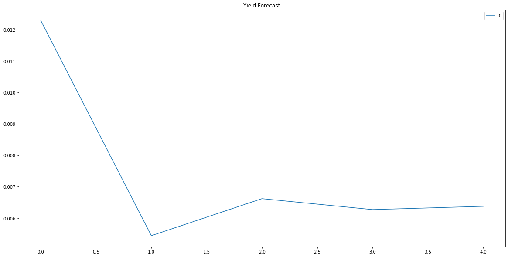
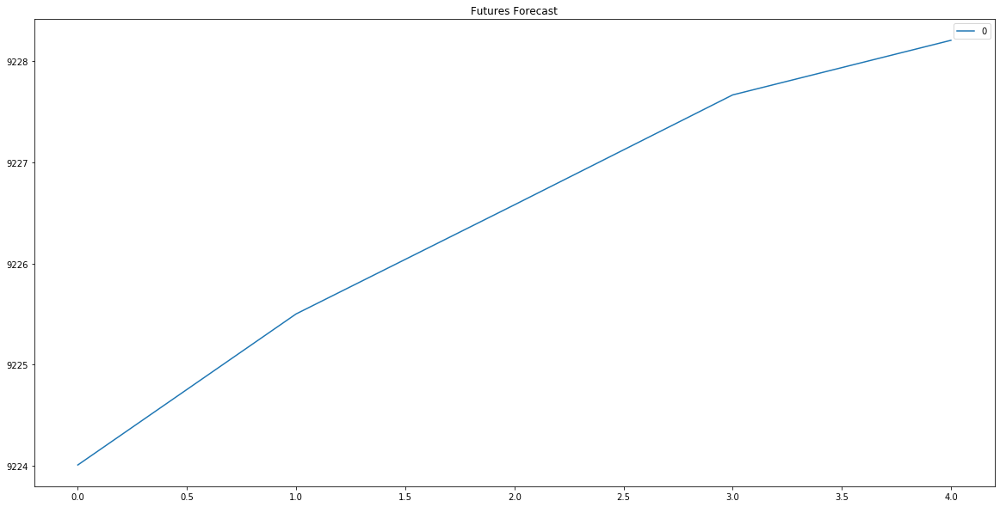
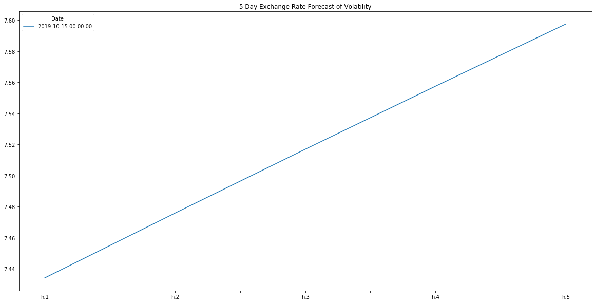
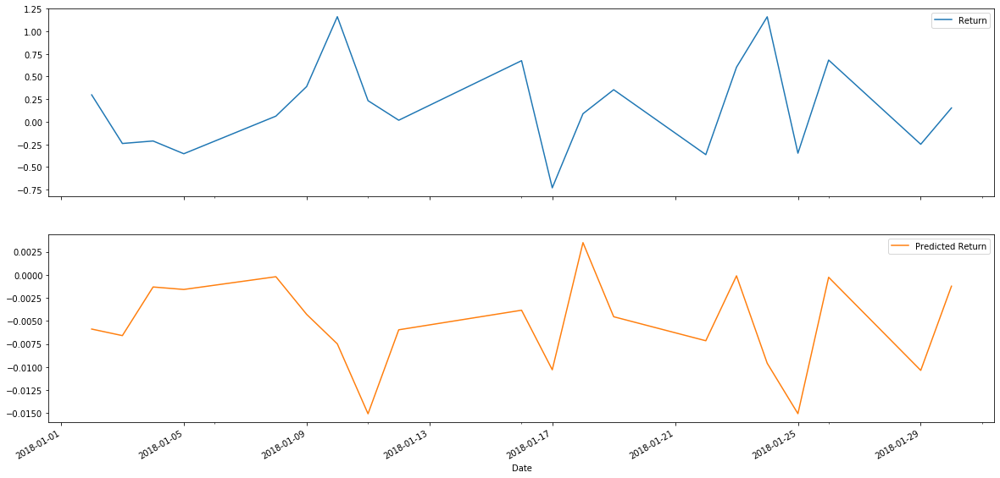

# A-Yen-for-the-Future
Time Series Forecasting and Linear Regression Modeling

## Time Series Analysis

### ARMA

* ARMA 5 day forecast

* Based on the ARMA model I would buying the Yen today, but I would rerun the prediction the next day since the yeild is forecast to decrease the next day and the GARCH model is forecasting increased volatility.

* Based on the AIC, BIC and p value, the ARMA is a better fit than the ARIMA. The P value is less than .5 and the AIC and BIC of the ARMA is a fifth of the ARIMA's AIC and BIC.

### ARIMA

* ARIMA 5 day forecast

* The ARIMA forecast for the Yen is steadily increaseing value which matches the ARMA's flat yield after day one. 

* Based on this model I would also buy the Yen, but based on the AIC and BIC scores this model does not look to be a good fit.

### GARCH

* Volatility Forecasting

* Based on the GARCH model, the volatility is steadily increasing

### Conclusions

* I would feel more confident using the ARMA model, but both models forecast a buy is better today, than in the next 5 days. If the market has not opened yet, I would looking at other models.

## Regression Analysis

* First 20 Actual Returns vs Predicted Returns

* Visually the Scikit_Learn linear regression model does not look usable. The frist spike is predicted to be a dip.

* The Scikit-Learn linear regression model perform better on out-of-sample data compared to in-sample data.

* The Out-of-sample RMSE (0.4152) is less than the In-sample RMSE (0.5659), therefore I beleive this model is not a good fit for this data set. Both numbers are less than 1, but the Returns and Predicted Returns are on a -1 to 1 scale therefore the numbers are not as low as they seem.
